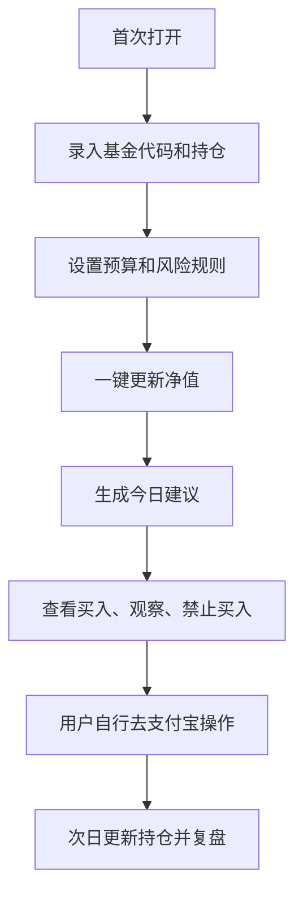

# 基金助手产品化方案

## 1. Summary

我们要把当前的本地基金脚本，包装成一个面向个人投资者的“基金持仓分析与定投决策助手”。第一版不做交易，不接管用户资金，只帮助用户维护持仓、更新净值、生成每日买入建议、展示组合风险。

产品核心价值是：把分散在支付宝截图、基金净值网站、个人定投规则里的信息，整理成一个每天可看的决策面板。

## 2. Contacts

| 角色 | 负责人 | 说明 |
| --- | --- | --- |
| 产品负责人 | 待定 | 确定目标用户、MVP 边界和商业化方式 |
| 技术负责人 | 待定 | 负责架构、数据源、算法、部署 |
| 合规/风控 | 待定 | 检查投资建议、免责声明、数据隐私边界 |
| 设计 | 待定 | 负责看板、配置页、日报体验 |

## 3. Background

当前项目已经具备可运行的分析内核：

- `data/funds.json` 维护用户持仓、目标仓位、预算和风险规则。
- `scripts/fetch_funds.py` 抓取公开基金净值。
- `scripts/build_context.py` 计算组合上下文。
- `scripts/generate_report.py` 生成日报、看板和结构化买入计划。
- `run_cached.cmd` 和 `run_daily.cmd` 提供本地入口。

但它还是脚本形态，使用门槛高：

- 用户需要手动编辑 JSON。
- 看板是静态 HTML，不能在线编辑配置。
- 报告和规则解释还不够产品化。
- 数据抓取失败时没有良好的提示和降级。
- 不能区分个人工具、可分发应用和商业产品的合规边界。

现在产品化的关键，不是立刻做复杂 AI，而是先把“能跑的分析内核”变成“普通人可以每天打开使用的工具”。

## 4. Objective

### 产品目标

做一个本地优先的基金助手，帮助用户每天回答三个问题：

1. 今天哪些基金可以加？
2. 每只大概加多少钱？
3. 当前组合最大的风险是什么？

### 成功指标

- 用户 5 分钟内完成首次持仓录入。
- 每日分析任务成功率达到 95% 以上。
- 用户能在首页看懂今日建议，不需要打开 JSON 或命令行。
- 每次建议都能解释“为什么买、为什么不买”。
- 所有建议明确标注为辅助分析，不提供承诺收益或自动交易。

## 5. Market Segment

### 第一目标用户

有支付宝/天天基金持仓、每月定投 300-5000 元、希望控制仓位但不会自己写表格的个人投资者。

他们的问题：

- 基金太多，不知道今天该不该买。
- 看净值、收益、估值和仓位很分散。
- 容易追涨，缺少执行纪律。
- 想要一个“每天提醒我按规则做”的工具。

### 不适合的用户

- 想要短线交易信号的人。
- 想让系统自动买卖的人。
- 需要专业投顾服务的人。
- 机构投资者。

## 6. Value Proposition

### 用户获得什么

- 一个统一的基金组合面板。
- 每日可执行的定投/加仓建议。
- 每条建议背后的原因和风险。
- 仓位是否偏离目标的直观提醒。
- 历史日报，便于复盘规则是否有效。

### 我们比普通表格强在哪里

- 自动拉净值。
- 自动算净值位置、回撤、涨跌、仓位。
- 自动过滤超仓、QDII 延迟、追涨风险。
- 自动生成日报和结构化交易计划。

### 我们不承诺什么

- 不承诺收益。
- 不判断市场顶部/底部。
- 不提供自动交易。
- 不替代基金销售机构、投顾或券商服务。

## 7. Solution

### 7.1 产品形态

建议分三层做：

1. 本地桌面版/本地网页版
   - 用户在自己电脑运行。
   - 数据保存在本地。
   - 适合第一版，隐私和合规压力最低。

2. 云端同步版
   - 用户登录后云端保存配置和历史报告。
   - 可做提醒、手机查看、多设备同步。
   - 需要更强的隐私、安全和合规设计。

3. 商业 SaaS 或小程序版
   - 面向更广用户。
   - 需要重点处理基金数据授权、投资建议边界、用户隐私和付费模式。

第一阶段建议只做本地网页版。

### 7.2 MVP 功能

#### 首页：今日建议

- 今日总预算。
- 建议买入列表。
- 可观察列表。
- 禁止买入列表。
- 今日组合风险。
- 数据更新时间。

#### 持仓管理

- 添加基金代码。
- 编辑持有金额。
- 编辑目标仓位。
- 编辑分类。
- 编辑截图收益。
- 校验总目标仓位是否接近 100%。

#### 策略设置

- 每月预算。
- 每日预算。
- 单只基金上限。
- 单类别上限。
- 最大每日买入基金数量。
- 最小买入金额。
- 是否启用 QDII 延迟保护。

#### 报告中心

- 查看最新日报。
- 查看历史日报。
- 查看结构化交易计划。
- 导出 Markdown/HTML。

#### 数据更新

- 一键更新净值。
- 更新失败时使用缓存。
- 显示每只基金数据是否过期。

### 7.3 V1 后功能

- 支付宝截图 OCR 导入持仓。
- 基金名称自动补全。
- 历史建议复盘。
- 策略模拟：如果按过去 6 个月规则执行，会买入多少、回撤如何。
- 多组合管理：稳健组合、进取组合、养老组合。
- 定时日报提醒。
- AI 解读日报，但 AI 不直接生成买卖金额，只解释规则输出。

### 7.4 用户流程



### 7.5 技术架构

#### 第一阶段：本地网页应用

推荐架构：

- 后端：Python FastAPI
- 前端：React + Vite
- 存储：本地 JSON 或 SQLite
- 数据抓取：复用现有 `fund_data.py`
- 报告生成：复用现有 `generate_report.py`
- 启动方式：一个本地命令打开浏览器

结构建议：

```text
.
├── backend/
│   ├── app.py
│   ├── services/
│   │   ├── fund_fetcher.py
│   │   ├── portfolio_analyzer.py
│   │   └── report_service.py
│   └── storage/
├── frontend/
│   ├── src/
│   └── package.json
├── data/
├── scripts/
└── docs/
```

#### 第二阶段：桌面打包

可选方案：

- Tauri：体积小，适合本地工具。
- Electron：生态成熟，但体积较大。
- PyInstaller + 本地 Web UI：改动小，但桌面体验弱一些。

优先建议：先做浏览器本地版，再考虑 Tauri。

## 8. 实现难度

### 难度 1：数据源稳定性

当前依赖公开基金接口，可能出现超时、限流、字段变化。

应对方案：

- 每只基金独立失败，不影响整体报告。
- 保留最近可用缓存。
- 明确显示数据日期和过期状态。
- 把数据抓取层独立封装，方便替换数据源。

难度等级：中。

### 难度 2：持仓录入体验

现在需要手写 JSON，这是产品化最大障碍。

应对方案：

- 做表单编辑器。
- 基金代码输入后自动补全名称。
- 提供比例校验和风险提示。
- 后续再做截图 OCR。

难度等级：中。

### 难度 3：规则解释

用户看到“建议买 30 元”时，必须知道依据是什么，否则不敢用。

应对方案：

- 每条建议显示得分、原因、风险。
- 首页只放简短原因，详情页展示完整计算。
- 固定规则输出，AI 只做解释，不做原始决策。

难度等级：中。

### 难度 4：投资合规边界

这是商业化时最大的非技术风险。产品一旦面向公众，就容易被理解为投资建议。

应对方案：

- 定位为“个人持仓分析和规则执行工具”。
- 不提供收益承诺。
- 不做自动交易。
- 不做“一键跟投”。
- 不推荐用户未持有基金。
- 每页保留辅助分析免责声明。
- 商业发布前需要专业合规审查。

难度等级：高。

### 难度 5：本地数据安全

持仓金额和收益属于敏感个人财务数据。

应对方案：

- 第一版默认本地存储。
- 不上传持仓。
- 如果后续做云同步，需要加密、账号体系、删除机制、隐私政策。

难度等级：中到高。

### 难度 6：算法可信度

当前规则可解释，但还不是经过长期回测验证的策略系统。

应对方案：

- 明确它是纪律工具，不是预测工具。
- 增加历史复盘和模拟。
- 把规则参数开放给用户调整。
- 保存每次建议，后续对比真实结果。

难度等级：中。

## 9. Release Plan

### Milestone 0：项目整理

目标：让项目可维护。

范围：

- 完成 README、依赖声明、忽略规则。
- 保证缓存日报可运行。
- 梳理现有脚本职责。

当前状态：已完成基础整理。

### Milestone 1：本地 Web MVP

目标：不用编辑 JSON，也能每天生成报告。

范围：

- FastAPI 后端。
- React 首页。
- 持仓管理表单。
- 策略设置页。
- 一键更新净值。
- 报告查看页。

预估：1-2 周。

### Milestone 2：产品体验增强

目标：让普通用户愿意每天打开。

范围：

- 基金代码搜索。
- 数据过期提示。
- 风险详情页。
- 历史日报列表。
- 买入计划导出。
- 错误提示和缓存降级。

预估：1-2 周。

### Milestone 3：桌面打包

目标：用户双击即可使用。

范围：

- 本地启动器。
- 打包安装包。
- 自动打开浏览器或内嵌 WebView。
- 本地数据目录迁移。

预估：1 周。

### Milestone 4：高级能力

目标：形成差异化。

范围：

- 截图 OCR 导入。
- 策略回测。
- AI 日报解释。
- 多组合管理。
- 定时提醒。

预估：持续迭代。

## 10. MVP 取舍

第一版必须做：

- 首页今日建议。
- 持仓表单。
- 策略设置。
- 一键生成报告。
- 缓存降级。

第一版不要做：

- 自动交易。
- 云同步。
- 手机 App。
- 社区跟投。
- 收益预测。
- 大模型自动决定买卖金额。

原因：这些功能会显著增加合规、稳定性和安全成本，不适合第一版。

## 11. 推荐技术路线

最稳妥路线：

1. 先把现有脚本封装成服务层，不改核心算法。
2. 用 FastAPI 暴露本地 API。
3. 用 React 做本地 Web UI。
4. 数据先继续用 JSON，等功能稳定后迁移 SQLite。
5. 所有报告生成逻辑先复用现有代码。
6. 等 MVP 跑通，再做桌面打包。

这样做的好处：

- 不浪费当前已经跑通的脚本。
- 风险集中在 UI 和接口层。
- 算法结果和现有日报可以对照验证。
- 后续容易扩展成桌面版或云端版。

## 12. 下一步执行清单

1. 把现有脚本拆成可调用函数，减少命令行脚本之间的 subprocess 调用。
2. 新建 FastAPI 后端，提供 `/api/portfolio`、`/api/settings`、`/api/run`、`/api/reports/latest`。
3. 新建 React 前端，先做首页和持仓编辑。
4. 加配置校验，防止错误 JSON 导致报告失败。
5. 给数据更新加超时、单基金失败隔离和缓存降级提示。
6. 用当前 `data/funds.json` 作为第一批真实样例验证。

